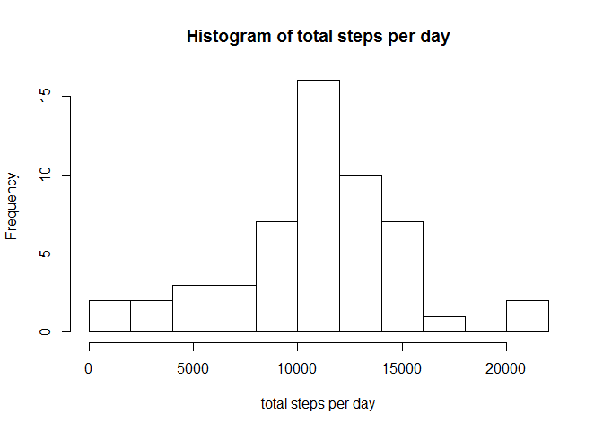
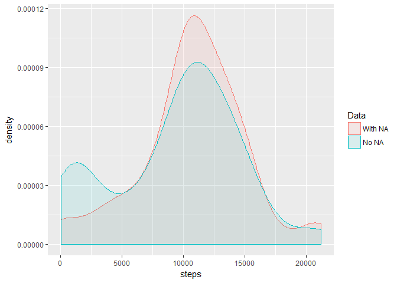
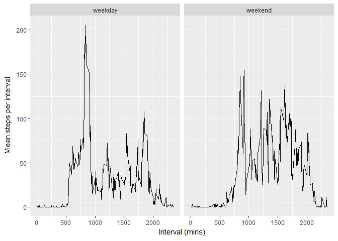

# Reproducible Research Course Project 1


## Loading and preprocessing the data
1. Load the data (i.e. read.csv())

```r
activity <- read.csv("activity.csv", na.strings = "NA") 
```

2. Process/transform the data (if necessary) into a format suitable for your analysis

```r
library(data.table)
```

```r
activity <- data.table(activity) 
activity$steps <- as.numeric(activity$steps)
```

## What is mean total number of steps taken per day?
1. Calculate the total number of steps taken per day

```r
library(dplyr)
```

```r
#Find total steps each day 
total_steps_per_day <- aggregate(steps ~ date, activity, sum)

#Plot histogram
hist(as.numeric(unlist(total_steps_per_day[2])),
     breaks = 10,
     xlab = "total steps per day",
     main = "Histogram of total steps per day")
```

<!-- -->

2. Calculate and report the mean and median of the total number of steps taken per day


```r
library(dplyr)
```

```r
mean_steps_day <- mean(total_steps_per_day$steps)

print(mean_steps_day)
```

```
## [1] 10766.19
```


```r
median_steps_day <- median(total_steps_per_day$steps)

print(median_steps_day)
```

```
## [1] 10765
```

## What is the average daily activity pattern?
1. Make a time series plot (i.e. type = "l") of the 5-minute interval (x-axis) and the average number of steps taken, averaged across all days (y-axis)


```r
plot(aggregate(steps~interval, data=activity, mean), type="l")
```

<!-- -->

2. Which 5-minute interval, on average across all the days in the dataset, contains the maximum number of steps?

```r
aggregate(steps~interval, data=activity, mean) %>% 
        arrange(desc(steps)) %>% 
        top_n(1) %>% 
        select(interval)
```

```
## Selecting by steps
```

```
##   interval
## 1      835
```

## Imputing missing values
1. Calculate and report the total number of missing values in the dataset (i.e. the total number of rows with NAs)


```r
sum(is.na(activity))
```

```
## [1] 2304
```

2. Devise a strategy for filling in all of the missing values in the dataset. The strategy does not need to be sophisticated. For example, you could use the mean/median for that day, or the mean for that 5-minute interval, etc.

I used median of the respective 5-minute intervals to fill missing values

```r
median_step_interval <- aggregate(steps ~ interval, data=activity, median)

isna <- is.na(activity$steps)
activity2 <-  activity
```

3. Create a new dataset that is equal to the original dataset but with the missing data filled in.


```r
for (i in 1:length(isna)){
        if (isna[i]==TRUE){
                activity2$steps[i] <- 
                        filter(median_step_interval, interval == activity2$interval[i])[2]
                } 
}
```

4.Make a histogram of the total number of steps taken each day and Calculate and report the mean and median total number of steps taken per day. Do these values differ from the estimates from the first part of the assignment? What is the impact of imputing missing data on the estimates of the total daily number of steps?

The impact is the difference you see in the density histogram and the difference in mean and median

```r
activity2 <- data.table(activity2) 
activity2$steps <- as.numeric(activity2$steps)
total_steps_per_day2 <- aggregate(steps ~ date, activity2, sum)

combined_steps <- bind_rows(total_steps_per_day,
                            total_steps_per_day2,
                            .id = "id")

combined_steps$id <- as.factor(combined_steps$id)

levels(combined_steps$id) <- c("With NA","No NA")
colnames(combined_steps)[1] <- "Data"
library(ggplot2)
ggplot(combined_steps, aes(steps, fill = Data, colour = Data)) +
  geom_density(alpha = 0.1) 
```

<!-- -->

```r
mean_steps_day2 <- mean(total_steps_per_day2$steps)

median_steps_day2 <- median(total_steps_per_day2$steps)

mean_diff <- mean_steps_day2 - mean_steps_day
mean_diff
```

```
## [1] -1262.32
```

```r
median_diff <- median_steps_day2 - median_steps_day
median_diff
```

```
## [1] -370
```
 

## Are there differences in activity patterns between weekdays and weekends?

1. For this part the weekdays() function may be of some help here. Use the dataset with the filled-in missing values for this part.


```r
activity2$date <- as.Date(as.character(activity2$date))
```

2. Create a new factor variable in the dataset with two levels - "weekday" and "weekend" indicating whether a given date is a weekday or weekend day.

```r
x=vector('character')
for (i in 1:length(activity2$date)){
        day <- weekdays(activity2$date[i])
        x <- c(x,
               switch(day,
                    "Monday"= "weekday",
                    "Tuesday"= "weekday",
                    "Wednesday" = "weekday",
                    "Thursday" = "weekday",
                    "Friday" = "weekday",
                    "Saturday" = "weekend",
                    "Sunday" = "weekend")
        )
}

activity2 <- x%>%
        as.factor() %>% 
        data.table() %>% 
        bind_cols(activity2)

colnames(activity2)[1] <- "weekday_or_weekend"
```

3. Make a panel plot containing a time series plot (i.e. type = "l") of the 5-minute interval (x-axis) and the average number of steps taken, averaged across all weekday days or weekend days (y-axis). See the README file in the GitHub repository to see an example of what this plot should look like using simulated data.

```r
meansteps_interval_wkday_wkend <- aggregate(steps ~ interval + weekday_or_weekend,
          data=activity2,
          mean)

ggplot(meansteps_interval_wkday_wkend, aes(interval, steps)) +
        geom_line(alpha = 1) +
        facet_grid(. ~ weekday_or_weekend) +
        labs(x = expression("Interval (mins)")) +
        labs(y = expression("Mean steps per interval"))
```

<!-- -->

